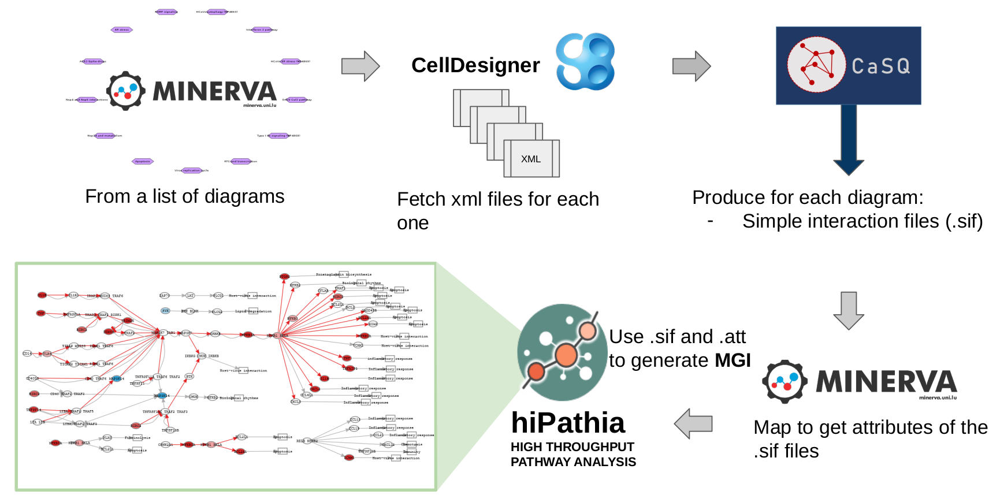

# Mechanistic modelling of COVID-19 diagrams with patients transcriptional responses to SARS-CoV2 infection

## Contributors:
* Marina Esteban-Medina, marina.esteban@juntadeandalucia.es
* Kinza Rian, kinza.rian@juntadeandalucia.es
* María Peña-Chilet, maria_pena@iislafe.es
* Joaquín Dopazo, joaquin.dopazo@juntadeandalucia.es
* Marek Ostaszewski, marek.ostaszewski@uni.lu

## Scope: 
Mechanistic models of signaling pathways provide a framework for interpreting gene expression or genomic variation data. These models are vital for understanding disease progression or drug response, especially in complex diseases. HiPathia is a mechanistic modelling method that analyzes transcriptomic and/or genomic data to estimate the cell functional profile triggered by the studied condition. It has been implemented as an R/Bioconductor application, a Web server, and a Cytoscape app, and has proven effective in predicting cell activities related to various conditions, including cancer. 

## Methodology: 

**Parsing the COVID-19 disease map diagrams:** 

Starting from the CellDesigner diagrams we used the tool CaSQ (https://gitlab.inria.fr/soliman/casq) to obtain SBML files with attributes and Simple Interaction Files (SIF) from the COVID19 Disease Map diagrams, incorporating the Activity Flow (AF) structure of Process description (PD) diagrams. Then specific calls to the Minerva platform were made to retrieve the node's attributes (Entrez IDs, Gene Symbols, Gene Names, Drugs, Metabolites..). Simplifications were made in order to achieve an interoperable HiPathia format: 

* All interactions were simplified to activation/inhibition.
* Operations to avoid feedback loops.
* End-nodes must contain gene elements
* End-nodes are tagged with functional annotations.

Results from the parsed PD diagrams are transformed into an .att + .sif file that will we compiled into a metagraph info database for the CoV-Hipathia web-tool.

The output diagrams can be access at http://hipathia.babelomics.org/covid19/, selecting as Pathway source: Disease Maps Community curated-pathways.

**Pre-processing of RNA-seq Dataset for CoV-HiPhathia mechanistic analysis of COVID-19 diagrams:**

* Public RNA-seq dataset (GEO GSE152075) of 430 individuals with SARS-CoV-2 and 54 negative controls used for testing.
* RNA-seq gene expression data normalized using Trimmed Mean of M values (TMM) with edgeR R package (Robinson et al., 2009).
* Hipathia algorithm requires rescaling of expression data between 0 and 1 for signal calculation.
* Quantile normalization performed using the preprocessCore R package (Bolstad et al., 2003).
* Normalized gene expression values used to calculate activation levels of subpathways.
* Case/control contrast using Wilcoxon test to assess differences in signaling activity between SARS-CoV-2 infected and normal control nasopharyngeal tissue.

## Results: 

**Visualization of results in the CoV-Hipathia webtool**

* In order to visualize the analysis of the GSE152075 expression data over the COVID-19 diagrams we have uploaded the normalized expression matrix and the design matrix (for the comparison) with the samples to the CoV-Hipathia web tool at http://hipathia.babelomics.org/covid19/.

* We have specifically selected as Pathway source: "Disease Maps Community curated-pathways"

**Results CoV-Hipathia webtool COVID-19 diagrams **

* Identified 77 out of 176 circuits in the COVID-19 disease map as differentially activated in infected versus non-infected individuals.
* Observed high activation in the Interferon-1 pathway, indicative of antiviral defense response. However, not all genes in this pathway are overexpressed, suggesting selective gene-driven activation.
* Noted significant overactivation in the IFN-lambda signaling pathway, aligning with its role in innate antiviral responses and respiratory pathogen activity. This supports targeting this pathway as a potential treatment approach, as evidenced by Feld et al., 2021.
* Found upregulation in the renin-angiotensin pathway, likely due to ACE2's interaction with SARS-CoV-2. This may contribute to increased vasoconstriction, as outlined in Vaduganathan et al., 2020.
